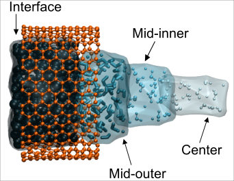

# zone_RDF

zone_RDF is a python tool written from MDAnalysis that analyses MD trajectories to compute the Radial Distribution Function (RDF) of ions within different radial sections of a carbon nanotube (CNT) pore. Ions are dynamically selected based on their radial positions [^1] within the pore and the RDF is calculated with respect to the oxygen atoms of water molecules (OW).



The radial sections are divided up into four regions: interface, mid-outer, mid-inner and center. 

### Features 
- Computed RDF for ions in user-defined radial sections of the CNT pore.
- Dynamically selects ions based on their location in each frame. i.e. if ion moves beyond a radial boundary in a given frame, it is no longer included in the calculation.
- Outputs RDF values and ion coordination numbers to csv files. 
- A Jupter notebook (`calculate_occurence.ipynb`) is provided for visualisation.

### Usage
#### Step 1: Run RDF analysis
Instead of running `md_rdf_analysis.py` manually, you can use the `run_rdf_analysis.py` script to automate RDF calculations across several pre-defined regions.

Run with:
```
python run_rdf_analysis.py
```
Outputs the following files in `analysis_results`:
- RDF plots (`.png`) and cumulative RDF plots per radial region.
- CSV files containing RDF values and coordination numbers.

#### Step 2: Visualise results in Jupyter Notebook
```
jupyter-notebook calculate_occurence.ipynb
```
This notebook:
- Loads RDFs and coordination numbers calculated in Step 1.
- Computes average coordination number distribution.
- Generates plots showing ion coordination in different CNT pore regions.

Outputs:
- A visualisation of coordination number distributions per radial region on a single plot (`coordno_distr.pdf`).


[^1]: Note: We tried the in-built `updating=True` in `u.select_atoms` for atom selection however this produced Cl$^-$-O RDF values of ~10, not comparable to experimental values. Hence the choice to recalculate the atom selection per frame. 


